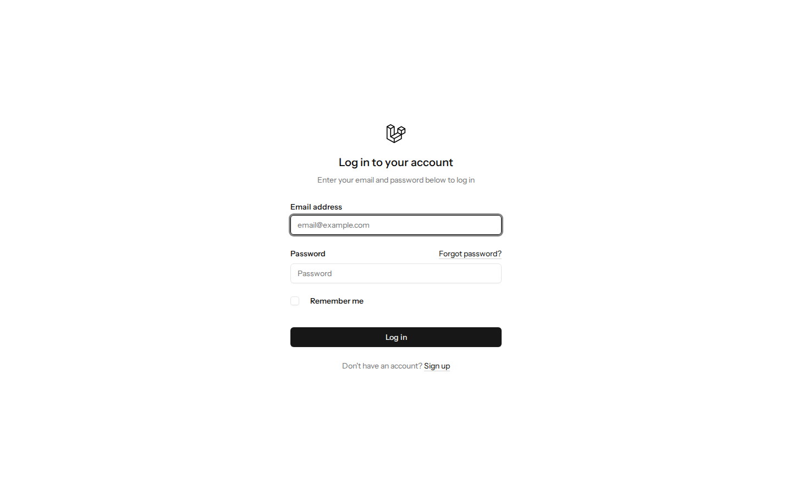
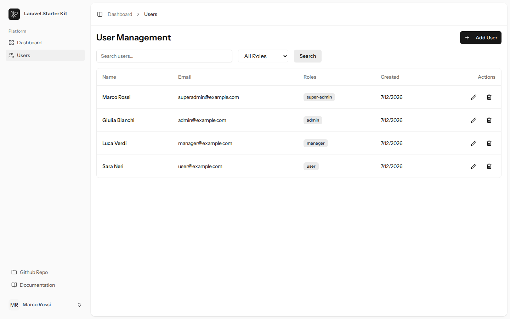
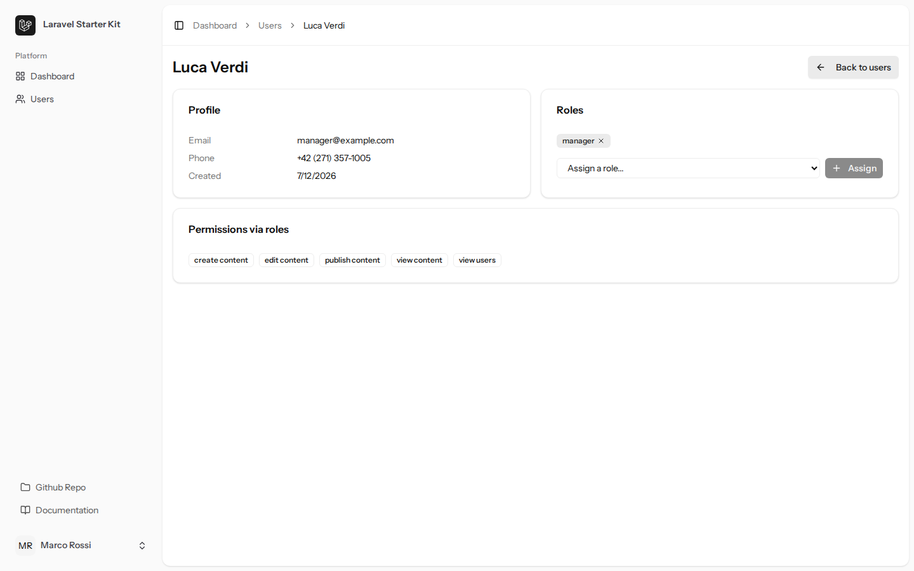

# Laravel Starter Template

[](https://github.com/davide-cardelli/laravel-starter/actions/workflows/ci.yml)
[](https://phpstan.org/)
[](https://opensource.org/licenses/MIT)

> **Production-ready Laravel 13 starter template** with Action-Based Architecture, User Management, Roles & Permissions, and complete quality tooling.

---

## 🎯 Why This Template?

- 🚀 **Production-Ready** - Not a tutorial, not a demo. Real code you can ship today
- 🏗️ **Architecture-First** - Enforced patterns with Deptrac, fully documented and testable
- 🧪 **Quality-Driven** - PHPStan Level 9, full Pest suite, automated git hooks
- 📚 **Learning Resource** - Complete real-world example with industry best practices
- 🔋 **Batteries Included** - Auth, 2FA, roles, permissions, user management CRUD
- 💪 **Type-Safe** - Full TypeScript support for frontend, PHPStan Level 9 for backend
- 🎨 **Modern UI** - Tailwind CSS 4 with shadcn/ui-inspired components
- ⚡ **Developer Experience** - Fast HMR, type-safe routes, git hooks, CI/CD ready

---

## 🆚 What this adds over the official starter kit

Laravel's official [`laravel/vue-starter-kit`](https://github.com/laravel/vue-starter-kit) gives you auth, a dashboard, and settings on Inertia + Vue. This template starts there and adds an opinionated, **enforced** foundation. Every row is verifiable in this repository:

| Capability | Official Vue starter kit | This template |
| --- | :---: | --- |
| Auth + 2FA (Fortify) | ✅ | ✅ |
| Roles & permissions (spatie) | ❌ | ✅ real, with admin user-management CRUD |
| Type-safe role/permission enums | ❌ | ✅ `App\Enums\Role` / `Permission` |
| Action-Based Architecture | ❌ | ✅ enforced by Deptrac |
| Static analysis | ❌ | ✅ PHPStan **level 9**, no baseline |
| Architecture tests | ❌ | ✅ Pest `arch()` — strict types, layer rules |
| Browser e2e tests | ❌ | ✅ Pest 4 browser testing (Playwright) |
| Rate-limited auth + error pages | partial | ✅ register/forgot throttled, Inertia 403/404/500/503 |
| Accessible confirm dialog / a11y | ❌ | ✅ reka-ui alert-dialog, aria labels |
| Agent-ready | ❌ | ✅ `AGENTS.md` + Laravel Boost |
| CI | basic | ✅ one workflow, PHP matrix, coverage ≥ 80% enforced |

## 🚫 What this is NOT

This is a **curated foundation**, not a SaaS boilerplate. By design it does **not** include:

- **Billing / subscriptions** — no Cashier, no payment flows.
- **Teams / multi-tenancy** — single-tenant user management only.
- **Code generators** — no `make:crud`; you copy the documented Action / Policy / Request pattern instead (see "Adding New Features").
- **A grab-bag of features** — every addition must earn its place and stay covered by tests and static analysis.

Need those? Add them deliberately on top of this base — the architecture is designed to absorb them cleanly.

## 📸 Screenshots

<!-- Curated screenshots go here, captured from the seeded demo app
     (superadmin@example.com / password):
     
     
      -->

_Run `composer setup` and sign in with the seeded demo accounts (below) to explore the login, user-management, and inline role-assignment flows._

---

## ✨ Features

### Core Stack
- **Laravel 13** - Latest features and improvements
- **Vue 3 + TypeScript + Inertia.js 3** - Modern, type-safe frontend
- **PostgreSQL** - Robust relational database
- **Laravel Sail** - Docker development environment
- **Spatie Permission** - Complete role and permission management
- **Laravel Fortify** - Authentication with 2FA support
- **Tailwind CSS 4** - Modern utility-first CSS framework

### Architecture & Code Quality
- **Action-Based Architecture** - Clean, testable, single-purpose business logic
- **PHPStan Level 9** - Maximum static analysis and type safety
- **Deptrac** - Automated architecture layer enforcement
- **Laravel Pint** - Consistent PHP code style (PSR-12)
- **ESLint + Prettier** - TypeScript/Vue code formatting
- **Git Hooks** - Pre-commit formatting, pre-push quality checks
- **Comprehensive Test Suite** - Unit, feature, and browser e2e tests with Pest 4; coverage enforced at ≥ 80% in CI

### Frontend Stack
- **Vite** - Lightning-fast hot module replacement
- **TypeScript** - Type-safe JavaScript with full IDE support
- **Laravel Wayfinder** - Type-safe routes for TypeScript
- **Reka UI** - Headless, accessible Vue components
- **Lucide Icons** - Beautiful, consistent icon library
- **Dark Mode** - Built-in theme switching

### Complete User Management Example
- **CRUD Operations** - Create, read, update, delete users
- **Role Management** - Assign and remove roles with proper authorization
- **Policy-Based Auth** - Fine-grained permission checking
- **Form Validation** - Client and server-side validation
- **Partials Pattern** - Reusable Vue form components
- **Audit Logging** - Track all user operations

---

## 🚀 Quick Start

### 📝 Using GitHub Template (Recommended)

1. **Click the green "Use this template" button** at the top of this repository
2. **Choose a name** for your new project
3. **Clone your new repository:**
   ```bash
   git clone https://github.com/YOUR-USERNAME/YOUR-PROJECT.git
   cd YOUR-PROJECT
   ```
4. **Follow installation steps below** (Option 1 or Option 2)

---

### Option 1: Docker Installation (Recommended)

Perfect for **quick setup** and **consistent environments**. No need to install PHP, PostgreSQL, or Redis locally.

**Prerequisites:**
- [Docker Desktop](https://www.docker.com/products/docker-desktop)
- [Git](https://git-scm.com/)

**Installation:**

```bash
# 1. Install PHP dependencies
composer install

# 2. Copy environment file
cp .env.example .env

# 3. Generate application key
php artisan key:generate

# 4. Start Docker containers
./vendor/bin/sail up -d

# 5. Run migrations and seed demo data
./vendor/bin/sail artisan migrate --seed

# 6. Install frontend dependencies and start dev server
./vendor/bin/sail npm install
./vendor/bin/sail npm run dev
```

**Access your application:**
- **App:** http://localhost
- **Mailpit (Email Testing):** http://localhost:8025
- **PostgreSQL:** localhost:5432
- **Redis:** localhost:6379

**Demo Credentials:**
| Role | Email | Password |
|------|-------|----------|
| Super Admin | superadmin@example.com | password |
| Admin | admin@example.com | password |
| Manager | manager@example.com | password |
| User | user@example.com | password |

**Useful Sail Commands:**

```bash
# Alias for convenience (add to ~/.bashrc or ~/.zshrc)
alias sail='./vendor/bin/sail'

# Start containers
sail up -d

# Stop containers
sail down

# Run tests
sail artisan test

# Access container shell
sail shell

# View logs
sail artisan pail
```

---

### Option 2: Native Installation

For developers who prefer **native PHP** or want **maximum performance**.

**Prerequisites:**
- PHP 8.3 or higher
- [Composer](https://getcomposer.org/)
- [Node.js 22+](https://nodejs.org/)
- PostgreSQL 13 or higher

**Installation:**

```bash
# 1. Copy and configure environment
cp .env.example .env
# Native install: set DB_HOST=127.0.0.1 (plus REDIS_HOST/MAIL_HOST if used)
# and create your database, plus a "testing" database for the test suite

# 2. One-command bootstrap: installs, migrates, seeds, builds
composer setup

# 3. Start development servers (Laravel + Vite)
composer dev
```

**Access your application:**
- **App:** http://localhost:8000

**Demo Credentials:** (same as Docker installation above)

---

## 🏗️ Architecture

### Action-Based Architecture

This template implements a **clean Action-Based Architecture** that separates business logic into focused, testable classes.

```
app/
├── Actions/           # Business logic (single responsibility)
│   └── User/
│       ├── CreateUser.php         # Create new user
│       ├── UpdateUser.php         # Update existing user
│       ├── DeleteUser.php         # Delete user
│       ├── AssignRoleToUser.php   # Assign role to user
│       └── RemoveRoleFromUser.php # Remove role from user
├── Http/
│   ├── Controllers/   # Thin orchestration layer
│   ├── Requests/      # Form validation rules
│   └── Middleware/
├── Models/            # Eloquent models (pure data)
└── Policies/          # Authorization logic
```

**Why Actions?**

- ✅ **Single Responsibility** - Each action does ONE thing
- ✅ **Testable in Isolation** - Easy to unit test without HTTP layer
- ✅ **Reusable** - Use in controllers, jobs, console commands
- ✅ **Type-Safe** - Full PHPDoc and type hints
- ✅ **Logged** - Built-in operation logging for audit trails

### Architecture Rules (Enforced by Deptrac)

```yaml
Enums       → (no dependencies — leaf domain primitives)
Models      → Enums
Policies    → Models, Enums
Actions     → Models, Enums
Controllers → Actions, Models, Requests, Policies, Enums
Requests    → Models, Enums
Jobs        → Actions, Models
Middleware  → Models, Enums
```

**Validate compliance:**
```bash
composer deptrac
```

---

## 👥 User Management Example

This template includes a **complete User Management implementation** as a real-world reference.

### Backend Components

| Component | Purpose | Location |
|-----------|---------|----------|
| **UserPolicy** | Authorization rules | `app/Policies/UserPolicy.php` |
| **Actions** | Business logic | `app/Actions/User/` |
| **Controller** | HTTP handling | `app/Http/Controllers/UserController.php` |
| **Requests** | Form validation | `app/Http/Requests/` |

### Frontend Components

| Page | Purpose | Location |
|------|---------|----------|
| **Index** | User list with search/pagination | `resources/js/pages/admin/users/Index.vue` |
| **Show** | User detail with inline role management (Inertia `useHttp` + optimistic UI) | `resources/js/pages/admin/users/Show.vue` |
| **Create** | User creation form | `resources/js/pages/admin/users/Create.vue` |
| **Edit** | User editing form | `resources/js/pages/admin/users/Edit.vue` |
| **UserForm** | Reusable form partial | `resources/js/pages/admin/users/partials/UserForm.vue` |

### Permissions

```php
'view users'   // View user list
'create users' // Create new users
'edit users'   // Edit existing users
'delete users' // Delete users
'assign roles' // Manage user roles
```

### Usage Example

```php
// app/Http/Controllers/UserController.php
use App\Actions\User\CreateUser;
use App\Http\Requests\StoreUserRequest;

public function store(StoreUserRequest $request, CreateUser $createUser)
{
    // Action handles business logic
    $user = $createUser->execute($request->validated());

    return redirect()->route('users.index')
        ->with('success', 'User created successfully');
}
```

---

## 🔒 Roles & Permissions

### Default Roles

| Role | Permissions | Description |
|------|-------------|-------------|
| **super-admin** | All permissions | Full system access |
| **admin** | User + content management | Administrative access |
| **manager** | Content management | Content editing only |
| **user** | Basic viewing | Standard user access |

### Customization

Edit `database/seeders/RolePermissionSeeder.php` to customize for your application needs.

### Permission Checking

```php
// In Blade/Vue templates
@can('edit users')
    <button>Edit</button>
@endcan

// In controllers (via Policy, using Laravel 13 attributes)
#[Authorize('update', 'user')]
public function edit(User $user): Response { /* ... */ }

// In code
if ($user->can('delete users')) {
    // Perform action
}
```

---

## 🛠️ Development Commands

### Code Quality

```bash
# Run all quality checks
composer test           # Pest tests
composer analyse        # PHPStan Level 9
composer deptrac        # Architecture validation
composer format         # Format PHP (Pint)
npm run lint            # ESLint
npm run type-check      # TypeScript validation
npm run format          # Prettier formatting
```

### Development Workflow

```bash
# With Sail
sail up -d              # Start containers
sail artisan test       # Run tests
sail artisan pail       # View logs in real-time
sail npm run dev        # Start Vite HMR

# Without Sail
composer dev            # Start all servers
php artisan test        # Run tests
php artisan pail        # View logs
npm run dev             # Start Vite
```

### Git Hooks (Versioned)

Hooks live in `.githooks/` (tracked in the repository) and are activated by
`composer setup` — or manually with `git config core.hooksPath .githooks`.

**Pre-commit** (fast):
- ✅ Checks the staged PHP files with Laravel Pint (`--test`)
- ✅ Checks the staged TS/Vue/CSS files with Prettier (`--check`)
- Aborts with guidance if anything needs formatting — it never edits or re-stages
  files, so partially-staged work is never silently pulled into the commit

**Pre-push** (full gate, mirrors CI):
- ✅ TypeScript type checking
- ✅ ESLint validation
- ✅ PHPStan Level 9 analysis
- ✅ Deptrac architecture validation
- ✅ Full test suite (auto-detects Sail)
- ✅ Production build

Run the static, style, architecture and build gates locally with `composer check`
(run the test suite separately with `sail composer test`, which needs the database).

---

## 🔄 CI/CD

### GitHub Actions

Every push and pull request automatically runs:

**Quality Matrix:**
| Check | Purpose | Tool |
|-------|---------|------|
| **Tests** | PHP 8.3 + PostgreSQL 18 | Pest |
| **PHPStan** | Level 9 static analysis | PHPStan |
| **Deptrac** | Architecture enforcement | Deptrac |
| **Pint** | Code style validation | Laravel Pint |
| **TypeScript** | Type checking | vue-tsc |
| **ESLint** | Code linting | ESLint |
| **Prettier** | Format checking | Prettier |
| **Build** | Frontend compilation | Vite |

**Configuration:** `.github/workflows/ci.yml`

### Dependabot

Automatic dependency updates run **weekly (Mondays 9:00 AM)**:

- 📦 **Composer** - Laravel, Spatie, testing tools
- 📦 **npm** - Vue, Vite, TypeScript, UI components
- 🔧 **GitHub Actions** - Workflow versions

**Features:**
- Auto-creates PRs for security patches
- CI runs on every Dependabot PR
- Ignores major Vue/Vite updates (manual review required)
- Limits to 10 concurrent PRs

**Configuration:** `.github/dependabot.yml`

---

## 📊 Logging & Monitoring

All Actions include **comprehensive logging** for debugging and audit trails.

### Real-time Monitoring

```bash
# With Sail
sail artisan pail

# Without Sail
php artisan pail
```

### What Gets Logged

Every Action logs:
- ✅ **Operation start** - User ID, parameters, context
- ✅ **Operation success** - Results, created IDs
- ⚠️ **Warnings** - Sensitive operations (deletions)
- ❌ **Errors** - Full context for troubleshooting

### Example Log Output

```
[INFO] Creating new user
  email: john@example.com
  first_name: John
  last_name: Doe
  phone: +39 333 1234567
  created_by: 1

[INFO] User created successfully
  user_id: 42
  email: john@example.com
  name: John Doe

[INFO] Assigning role to user
  user_id: 42
  role: admin
  assigned_by: 1

[INFO] Role assigned successfully
  user_id: 42
  role: admin
```

### Security

- 🔒 **Passwords never logged** - Only hashed values stored
- 🔒 **Sensitive data protected** - Tokens, API keys excluded
- 🔒 **Audit trail** - All operations tracked with user context

---

## 🧪 Testing

```bash
# Run all tests (inside Sail)
sail composer test

# Run tests natively: phpunit.xml env entries are overridable from
# your shell (requires a local "testing" PostgreSQL database)
DB_HOST=127.0.0.1 DB_USERNAME=your_user DB_PASSWORD=your_password php artisan test

# Run specific test suite
composer test -- --filter=UserManagementTest

# Run tests in parallel (faster)
composer test:parallel

# Generate HTML coverage report
composer test:coverage

# Profile slow tests
composer test:profile
```

**Test Structure:**
```
tests/
├── Browser/           # Pest 4 browser e2e (Playwright, Sail-only)
├── Feature/           # Integration tests
│   ├── Auth/         # Authentication + real 2FA (TOTP, recovery, throttle)
│   ├── Settings/     # User settings
│   ├── ErrorPagesTest.php
│   └── UserManagementTest.php
└── Unit/              # Isolated unit tests
    ├── Actions/      # Action classes
    ├── Enums/        # Role/permission enums
    ├── ArchTest.php  # Architecture rules (strict types, layer boundaries)
    └── Policies/     # Authorization rules
```

**Notes:**
- Line coverage is enforced at **≥ 80%** in CI (`composer test:coverage`, non-browser suites); it currently sits well above that.
- Browser tests drive a real headless browser via Playwright and run **inside Sail** (`composer test:browser`); `composer setup` installs the browser for you.

---

## 📝 Adding New Features

### 1. Create an Action

```php
// app/Actions/Post/CreatePost.php
namespace App\Actions\Post;

use App\Models\Post;
use Illuminate\Support\Facades\Auth;
use Illuminate\Support\Facades\Log;

/**
 * Create Post Action
 *
 * Creates a new post with validated data.
 */
class CreatePost
{
    /**
     * Execute the create post action.
     *
     * @param  array<string, mixed>  $data  Validated post data
     * @return \App\Models\Post  Created post instance
     */
    public function execute(array $data): Post
    {
        Log::info('Creating new post', [
            'title' => $data['title'],
            'created_by' => Auth::id(),
        ]);

        $post = Post::create($data);

        Log::info('Post created successfully', [
            'post_id' => $post->id,
            'title' => $post->title,
        ]);

        return $post;
    }
}
```

**Best Practices:**
- ✅ PHPDoc with description, @param, @return
- ✅ Full type hints
- ✅ Log operation start and completion
- ✅ Use appropriate log levels
- ❌ Never log sensitive data

### 2. Create a Controller

```php
// app/Http/Controllers/PostController.php
namespace App\Http\Controllers;

use App\Actions\Post\CreatePost;
use App\Http\Requests\StorePostRequest;

class PostController extends Controller
{
    /**
     * Store a newly created post.
     */
    public function store(StorePostRequest $request, CreatePost $createPost)
    {
        $post = $createPost->execute($request->validated());

        return redirect()->route('posts.index');
    }
}
```

### 3. Add Routes and Vue Pages

```php
// routes/web.php
Route::resource('posts', PostController::class);
```

```bash
# Regenerate TypeScript routes
php artisan wayfinder:generate --with-form
```

### 4. Validate Architecture

```bash
composer deptrac  # Ensures architecture compliance
```

---

## 🔧 Troubleshooting

### Port Already in Use

```bash
# Change ports in .env or compose.yaml
APP_PORT=8080 ./vendor/bin/sail up -d
```

### npm Build Errors

```bash
# Clear and reinstall
rm -rf node_modules package-lock.json
npm install
```

### Database Connection Issues

```bash
# Reset database and volumes
./vendor/bin/sail down -v
./vendor/bin/sail up -d
./vendor/bin/sail artisan migrate:fresh --seed
```

### Permission Denied on Git Hooks

```bash
# Make hooks executable
chmod +x .git/hooks/pre-commit
chmod +x .git/hooks/pre-push
```

### PHPStan Cache Issues

```bash
# Clear PHPStan cache
./vendor/bin/sail composer analyse -- --clear-result-cache
```

---

## 📁 Project Structure

```
laravel-starter/
├── app/
│   ├── Actions/              # Business logic
│   ├── Http/
│   │   ├── Controllers/      # HTTP handlers
│   │   ├── Requests/         # Form validation
│   │   └── Middleware/
│   ├── Models/               # Eloquent models
│   └── Policies/             # Authorization
├── database/
│   ├── factories/            # Model factories
│   ├── migrations/           # Database schema
│   └── seeders/              # Data seeding
├── resources/
│   ├── css/                  # Tailwind CSS
│   └── js/
│       ├── components/       # Vue components
│       │   ├── ui/          # shadcn/ui components
│       │   └── ...
│       ├── layouts/          # Page layouts
│       ├── pages/            # Inertia pages
│       │   ├── admin/       # Admin pages
│       │   ├── auth/        # Auth pages
│       │   └── settings/    # Settings pages
│       ├── routes/           # Wayfinder routes (generated)
│       └── types/            # TypeScript types
├── routes/
│   ├── web.php               # Web routes
│   └── settings.php          # Settings routes
├── tests/
│   ├── Feature/              # Integration tests
│   └── Unit/                 # Unit tests
├── .github/
│   └── workflows/
│       └── ci.yml            # GitHub Actions CI
├── deptrac.yaml              # Architecture rules
├── phpstan.neon              # Static analysis config
├── compose.yaml              # Docker Compose (Sail)
└── package.json              # Frontend dependencies
```

---

## 🤝 Contributing

This is a **template repository** - feel free to:
- ⭐ Star it if you find it useful
- 🐛 Report issues
- 💡 Suggest improvements
- 🔀 Fork and customize for your needs

---

## 📄 License

**MIT License** - Use freely for personal or commercial projects.

---

## 🙏 Credits & Acknowledgments

Built with industry-leading tools and frameworks:

**Backend:**
- [Laravel](https://laravel.com) - PHP Framework
- [Spatie Laravel Permission](https://spatie.be/docs/laravel-permission) - Roles & Permissions
- [Laravel Fortify](https://laravel.com/docs/fortify) - Authentication
- [Pest PHP](https://pestphp.com) - Testing Framework
- [PHPStan](https://phpstan.org) - Static Analysis
- [Deptrac](https://qossmic.github.io/deptrac/) - Architecture Enforcement

**Frontend:**
- [Vue.js](https://vuejs.org) - Progressive Framework
- [Inertia.js](https://inertiajs.com) - Modern Monolith
- [TypeScript](https://www.typescriptlang.org) - Type Safety
- [Tailwind CSS](https://tailwindcss.com) - Utility-First CSS
- [Vite](https://vitejs.dev) - Build Tool
- [Reka UI](https://reka-ui.com) - Headless Components
- [shadcn/ui](https://ui.shadcn.com) - Design Inspiration
- [Lucide Icons](https://lucide.dev) - Icon Library

**Development:**
- [Laravel Sail](https://laravel.com/docs/sail) - Docker Environment
- [Laravel Pint](https://laravel.com/docs/pint) - Code Style
- [ESLint](https://eslint.org) - Linting
- [Prettier](https://prettier.io) - Code Formatting

---

**Ready to build something amazing?** 🚀

**[Use this template](https://github.com/davide-cardelli/laravel-starter/generate)** to get started in minutes!
